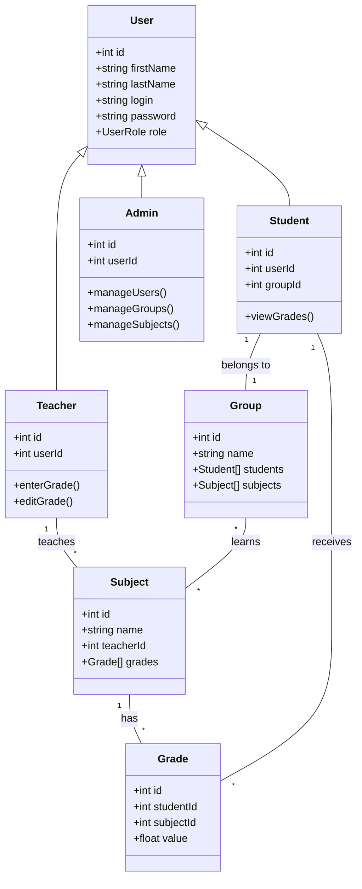
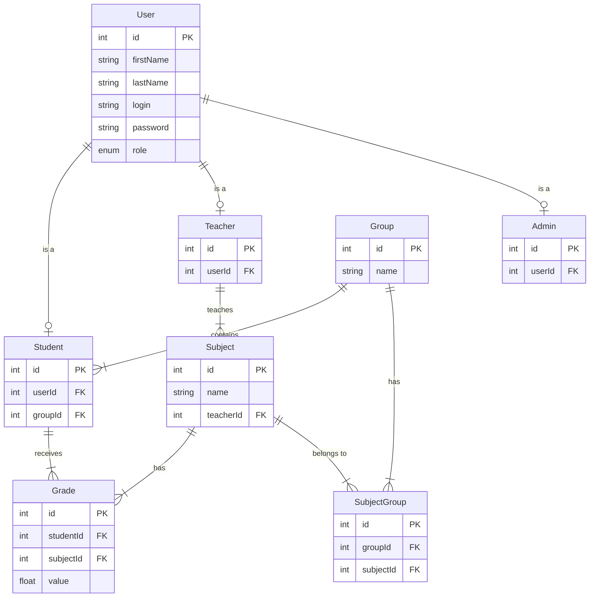

# ACADEMIC INFORMATION SYSTEM (AIS)
## Project Description and Documentation

**Vilniaus Kolegija / University of Applied Sciences**
**Faculty of Electronics and Informatics**

**Student:** [Your Name]
**Group:** [Your Group]
**Date:** 2025-12-02

---

## Contents

1. [Introduction](#1-introduction)
    - [1.1 Objective](#11-objective)
    - [1.2 Purpose](#12-purpose)
2. [Functional Requirements](#2-functional-requirements)
3. [Technical Requirements](#3-technical-requirements)
4. [Object-Oriented Programming Principles](#4-object-oriented-programming-principles)
5. [Technical Documentation](#5-technical-documentation)
    - [5.1 Class Diagram](#51-class-diagram)
    - [5.2 Database Structure (ERD)](#52-database-structure-erd)
    - [5.3 Description of Methods](#53-description-of-methods)
6. [User Documentation](#6-user-documentation)
    - [6.1 Task Formulation](#61-task-formulation)
    - [6.2 Login Data Generation](#62-login-data-generation)
    - [6.3 User Manual](#63-user-manual)
7. [Source Code](#7-source-code)

---

## 1. Introduction

### 1.1 Task Topic
Create a prototype of an Academic Information System that would record student evaluations of taught subjects, taking into account different user roles and rights.

### 1.2 Purpose of the System
The system must allow the administrator to manage study data (groups, lecturers, students, subjects), the lecturer to register and edit grades, and the student to view their assessments.

This project implements a three-tier architecture (UI, Logic, Data) and adheres to Object-Oriented Programming (OOP) principles to ensure scalability and maintainability.

---

## 2. Functional Requirements

The system implements the following functional requirements as specified in the assignment:

| No. | Requirement | Implementation Details |
| :--- | :--- | :--- |
| 1 | **User Roles** | Three distinct roles: **Administrator**, **Teacher**, **Student**. Login is role-based. |
| 2 | **Admin: Manage Data** | Administrator can create and delete Student Groups, Teachers, Students, and Subjects. |
| 3 | **Admin: Assignments** | Administrator assigns Teachers to Subjects and Students/Subjects to Groups. |
| 4 | **Teacher: Grades** | Teachers can enter, edit, and view grades only for the subjects they are assigned to teach. |
| 5 | **Student: View Grades** | Students can only view their own grades. Access is restricted based on their login session. |
| 6 | **Login Details** | Automatic credential generation: **Login = First Name**, **Password = Last Name**. |
| 7 | **Dialog Forms** | Data entry and editing (e.g., assigning subjects) are performed via modal dialog forms for better UX. |
| 8 | **Database** | Data is stored in a relational database (PostgreSQL) containing Users, Subjects, Groups, Grades, and their relationships. |
| 9 | **Login Logic** | The UI adapts dynamically based on the logged-in user's role (e.g., Admin sees a management sidebar, Students see only their grades). |

---

## 3. Technical Requirements

| No. | Requirement | Implementation Details |
| :--- | :--- | :--- |
| 1 | **Database Storage** | **PostgreSQL** is used as the RDBMS. Tables include `User`, `Student`, `Teacher`, `Admin`, `Group`, `Subject`, `Grade`, `SubjectGroup`. |
| 2 | **Object Model** | Prisma ORM defines the object model. Classes/Models in code (`User`, `Student`, etc.) directly correspond to database tables. |
| 3 | **Data Access Abstraction** | The system uses a **Service Layer** pattern (`AdminService`, `TeacherService`, `StudentService`) to abstract direct database operations from the UI. |
| 4 | **Error Handling** | The backend implements global error handling middleware. The frontend uses `try-catch` blocks and displays user-friendly toast notifications (via `sonner`) for errors like "Failed to save grade". |
| 5 | **Basic Architecture** | **Frontend (Next.js)** $\leftrightarrow$ **API Layer (Express/Node.js)** $\leftrightarrow$ **Database (PostgreSQL)**. |

---

## 4. Object-Oriented Programming Principles

The project demonstrates the following OOP principles:

### Encapsulation
Data and behavior are bundled within classes and services.
- **Example**: The `User` model encapsulates properties like `login` and `password`. Access to these fields is controlled through the API, and sensitive operations (like password hashing) are handled internally within the Auth service.
- **Code**: `UserService` contains private logic for user validation that is not exposed to the Controller.

### Inheritance
The system uses a hierarchical user structure.
- **Example**: `Student`, `Teacher`, and `Admin` are specialized entities that logically inherit from the base `User` entity. In the database, they share a common `User` table for authentication details (ID, Name, Login) while maintaining separate tables for role-specific data (e.g., `Student` has `groupId`).

### Polymorphism
Different roles interact with the system differently.
- **Example**: The "Dashboard" concept is polymorphic.
    - `Admin` dashboard shows system statistics.
    - `Teacher` dashboard shows assigned subjects.
    - `Student` dashboard shows personal grades.
    - The frontend renders the appropriate dashboard component based on the user's role type.

### Abstraction
Complex logic is hidden behind simple interfaces.
- **Example**: The `AuthService` abstracts the complexity of JWT token generation and verification. The frontend simply calls `login()` and receives a token, without needing to know the underlying encryption details.
- **Example**: The `AdminService` provides high-level methods like `assignSubjectToGroup`, hiding the complex SQL/Prisma join operations required to link these entities.

### SOLID Principles
- **Single Responsibility**: Each Service (e.g., `StudentService`, `TeacherService`) handles logic only relevant to that specific domain.
- **Open/Closed**: The system is designed to allow adding new roles or features (e.g., a "Parent" role) without modifying existing core authentication logic.
- **Interface Segregation**: The API endpoints are segregated by role (`/admin`, `/teacher`, `/student`), ensuring clients only depend on the methods they use.

---

## 5. Technical Documentation

### 5.1 Class Diagram

The following diagram represents the core classes and their relationships within the system's domain model.

### 5.2 Database Structure (ERD)

The Entity-Relationship Diagram (ERD) shows the database schema and foreign key constraints.

### 5.3 Description of Methods

The business logic is encapsulated in Service classes. Below are the key methods:

#### **AuthService**
- `login(login, password)`: Authenticates credentials against the `User` table. Returns a signed JWT containing the user's ID and Role.
- `validate(token)`: Decodes the JWT to verify session validity.

#### **AdminService**
- `getAllUsers()`: Fetches all users joined with their specific role data.
- `createUser(data)`: Creates a `User` record and the corresponding `Student` or `Teacher` record transactionally.
- `assignStudentToGroup(userId, groupId)`: Updates the `groupId` foreign key on the `Student` record.
- `assignSubjectToGroup(groupId, subjectId)`: Creates a many-to-many relationship record in `SubjectGroup`.
- `removeSubjectFromGroup(groupId, subjectId)`: Deletes the relationship record from `SubjectGroup`.

#### **TeacherService**
- `getAssignedSubjects(teacherId)`: Returns all `Subject` records where `teacherId` matches the logged-in teacher.
- `getStudentsBySubject(subjectId)`: Finds all `Groups` assigned to the subject, then retrieves all `Students` in those groups.
- `createGrade(studentId, subjectId, value)`: Inserts a new `Grade` record.
- `updateGrade(gradeId, value)`: Updates the `value` of an existing `Grade`.

#### **StudentService**
- `getMyGrades(studentId)`: Retrieves all `Grade` records for the student, joined with `Subject` details.

---

## 6. User Documentation

### 6.1 Task Formulation
The goal is to implement an Academic Information System where:
1.  **Administrators** set up the educational structure (Groups, Subjects, Teachers).
2.  **Teachers** perform the core academic function of grading.
3.  **Students** consume this information by viewing their results.

### 6.2 Login Data Generation
To facilitate easy testing and usage:
- When an Administrator creates a new user (Student or Teacher), they only provide the **First Name** and **Last Name**.
- The system **automatically** sets:
    - **Login**: The provided First Name.
    - **Password**: The provided Last Name.
- *Example*: Creating a student named "John Doe" results in Login: `John`, Password: `Doe`.

### 6.3 User Manual

#### **6.3.1 Logging In**
1.  Navigate to the home page (`/`).
2.  Enter your generated **Login** and **Password**.
3.  Click **"Sign in"**.

#### **6.3.2 Administrator Role**
*Access Level: Full System Control*
-   **Dashboard**: Overview of total system counts.
-   **Student Management**:
    -   Go to "Students".
    -   **Create**: Click "Add Student", enter name.
    -   **Assign Group**: Click the "Edit" (Pencil) icon next to a student, select a Group from the dialog, and save.
    -   **Search**: Use the search bar to find students by name or login.

-   **Admin Management**:
    -   Go to "Admins".
    -   **Create**: Click "Add Admin", enter name.
    -   **Search**: Use the search bar to find administrators.
-   **Teacher Management**:
    -   Go to "Teachers".
    -   **Create**: Click "Add Teacher", enter name.
    -   **Search**: Use the search bar to find teachers.
-   **Group Management**:
    -   Go to "Groups".
    -   **Create**: Click "Add Group", enter name (e.g., "IT-2024").
    -   **Manage Subjects**: Click the "Settings" (Gear) icon. A dialog opens where you can **Add** subjects to the group or **Remove** existing ones.
-   **Subject Management**:
    -   Go to "Subjects".
    -   **Create**: Click "Add Subject", enter name.
    -   **Assign Teacher**: Click the "Edit" icon to assign a specific Teacher to the subject.

#### **6.3.3 Teacher Role**
*Access Level: Grade Management*
-   **My Subjects**: The dashboard lists all subjects you are assigned to teach.
-   **Grading**:
    -   Click "Manage Grades" on a subject card.
    -   A list of all students taking this subject (via their groups) is displayed.
    -   **Enter Grade**: Type a value (1-10) in the input field.
    -   **Save**: Click the "Save" button. A success notification will appear.
    -   **Edit**: Simply change the value and click "Save" again.

#### **6.3.4 Student Role**
*Access Level: Read-Only*
-   **My Grades**: The dashboard displays a table of your subjects.
-   **View**: See the Subject Name, the Teacher, and your Grade.
-   **Status**: If no grade is assigned, it displays "N/A".

---

## 7. Source Code

The complete source code for this project is hosted on GitHub.

**Repository Link:** [https://github.com/icerahi/viko-ais](https://github.com/icerahi/viko-ais)
